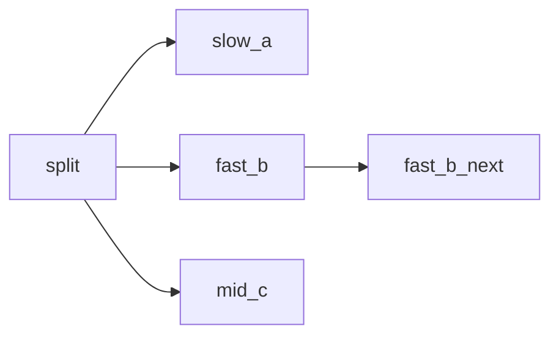

# DAG Engine (Eager Scheduling) Example

This example demonstrates the difference between the default **BSP** engine
(bulk synchronous parallel supersteps) and the opt‑in **DAG** engine (eager,
pipeline scheduling).

## Why this matters

In the BSP engine, the executor runs in supersteps:

1. Planning: compute runnable nodes
2. Execution: run them in parallel
3. Update: merge updates and apply routing signals

The next superstep starts only after **all** nodes in the current superstep
finish. This means a downstream node may wait for unrelated parallel branches.

The DAG engine removes the global barrier and schedules nodes as soon as their
own dependencies become ready.

## Graph used in this example



`fast_b_next` depends only on `fast_b`, but under BSP it still waits for
`slow_a` and `mid_c` because they are in the same superstep.

## Run

From this directory:

```bash
go run . -engine bsp
go run . -engine dag
go run . -engine both
```

## What to look for

The program prints timestamps for each node start/end.

- **BSP**: `fast_b_next` starts after `slow_a` finishes.
- **DAG**: `fast_b_next` starts soon after `fast_b` finishes (while `slow_a`
  is still running).

## Notes and limitations

- BSP is the default engine. DAG is opt‑in.
- In DAG mode, `WithStepTimeout` does not apply. Prefer a `context` deadline
  and/or `WithNodeTimeout`.
- In DAG mode, `WithMaxSteps` limits the number of **node executions** (not
  supersteps).
- DAG supports checkpoints and interrupts, but the cadence/semantics differ
  from BSP. See the Graph docs for details.
