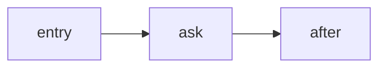

# DAG Engine: Interrupt & Resume Example

This example shows that the opt-in **DAG (eager) engine** supports:

- **Internal interrupts (HITL)** via `graph.Interrupt(...)`
- **Checkpoints** via `WithCheckpointSaver(...)`
- **Resume** from an interrupt checkpoint

The program runs twice:

1. First run: it executes until it hits `graph.Interrupt(...)` and pauses.
2. Second run: it resumes from the saved checkpoint and finishes.

## Graph used in this example



## Run

From this directory:

```bash
go run .
```

Flags:

- `-engine bsp|dag` (default: `dag`)
- `-resume <value>` (default: `ok`)

## What to look for

- The first run prints the interrupt event and its `checkpoint_id`.
- The second run prints the completion event and the final state.

